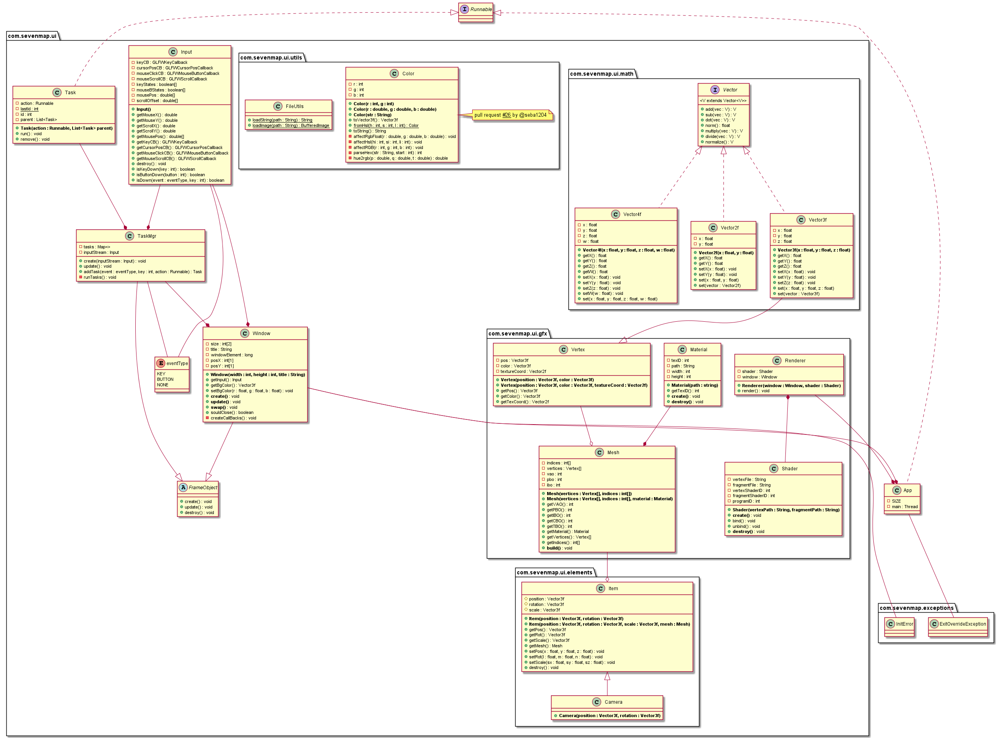

# Rapport de l'application 7map

## Sommaire

- [Rapport de l'application 7map](#rapport-de-lapplication-7map)
  - [Sommaire](#sommaire)
  - [Organisation et répartition du travail](#organisation-et-répartition-du-travail)
    - [Partie ``rendering``](#partie-rendering)
    - [Partie ``data``](#partie-data)

## Organisation et répartition du travail

Le processus de développement a été divisé en deux parties principales :

- rendering : affichage et rendu 3D
- data : gestion des données de l'application

Une équipe a été affectée à chaque partie.

Nous avons décidé de travailler avec git et Github pour des raisons de praticité.
Les noms d'utilisateurs Github de chacun des membres sont listés ci-dessous.

|             Team Rendering             |         Team Data          |
| :------------------------------------: | :------------------------: |
|    Philippe Negrel-Jerzy (@l3alr0g)    |   Félix Parain (@FaislX)   |
|       Hamid Oukhnini (@Mmzhk21)        | Selma Oujid  (@selmaoujid) |
| Mohamed M'Hand Ouammi    (@kingussopp) | Sébastien Pont (@seba1204) |

### Partie ``rendering``

**1ère itération :**

Nous avons étudié en détail l'API de [LWJGL](https://www.lwjgl.org/) (librairie graphique java s'apparentant à OpenGL) afin de cerner les possibilités qu'elle nous offre. Par la suite, nous avons mis en place un moteur de rendu rudimentaire permettant l'affichage de figures en 3D et de textures.

En l'état actuel des choses, l'application est une démonstration simple des capacités du moteur.

Voici le diagramme UML qui lui est associé (pour plus de détail, il est préférable de s'appuyer sur la javadoc).

**2ème itération :** 

- Nous avons ajouté une API pour Dear ImGui qui permet l'utilisation de menus
dans le moteur. Elle sera utilisée par la suite dans le programme principal afin d'afficher l'interface utilisateur.
- La transparence des textures sur les objets affichés en 3D est maintenant supportée.
- La caméra possède maintenant des methodes qui permettent de récupérer facilement son repère propre (pour calculer la direction de ses déplacements par exemple)
- Nous avons créé un logger sur lequel nous travaillons encore
- Les collisionneurs (colliders - ou objets détectant des collisions en 3D) ont été implémentés mais ne sont pas encore totalement fonctionnels. Ils permettent notamment de repérer les clics de souris sur un objet dans l'espace.
- Une démonstration des capacités graphique a été créée, elle permet notamment de réaliser des expériences graphiques avant de les ajouter au fichier principal, sans altérer directement le code de l'application.

### Partie ``data``

Le but de notre équipe est de fournir à l'équipe "rendering" les données nécessaires à l'affichage. Nous devons convertir des données sources (json) en objet Java utilisable par LWJGL.

Voici notre diagramme UML :

Les objets de la carte sont des `feature`, par exemple l'ENSEEIHT, la D314, ...

Chaque `feature` est reliée à une `category`, par exemple 'école', 'route', ...

`Map` est la classe qui fait le lien entre l'affichage et la gestion des données.
Elle détermine les `feature` à afficher, et les convertit en `Mesh`.

Nous avons décidé d'utiliser le standard GeoJson pour le stockage des données.

Nous avons créé un parseur convertissant les `features` (objet GeoJson) à l'aide de la librairie [jackson](https://mvnrepository.com/artifact/com.fasterxml.jackson.core/jackson-databind).
