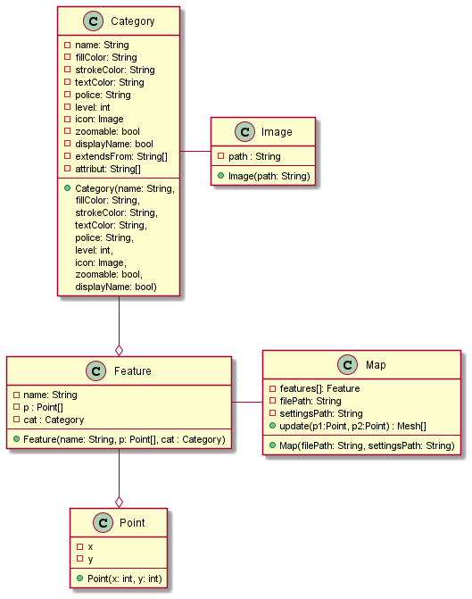

# Rapport de l'application 7map

## Sommaire

- [Rapport de l'application 7map](#rapport-de-lapplication-7map)
  - [Sommaire](#sommaire)
  - [Organisation et répartition du travail](#organisation-et-répartition-du-travail)
    - [Partie ``rendering``](#partie-rendering)
    - [Partie ``data``](#partie-data)
      - [1ère itération](#1ère-itération)
      - [2ème itération](#2ème-itération)

## Organisation et répartition du travail

Le processus de développement a été divisé en deux parties principales :

- rendering : affichage et rendu 3D
- data : gestion des données de l'application

Une équipe a été affectée à chaque partie.

Nous avons décidé de travailler avec git et Github pour des raisons de praticité.
Les noms d'utilisateurs Github de chacun des membres sont listés ci-dessous.

|             Team Rendering             |         Team Data          |
| :------------------------------------: | :------------------------: |
|    Philippe Negrel-Jerzy (@l3alr0g)    |   Félix Parain (@FaislX)   |
|       Hamid Oukhnini (@Mmzhk21)        | Selma Oujid  (@selmaoujid) |
| Mohamed M'Hand Ouammi    (@kingussopp) | Sébastien Pont (@seba1204) |

### Partie ``rendering``

- Nous avons ajouté une API pour Dear ImGui qui permet l'utilisation de menus
dans le moteur. Elle sera utilisée par la suite dans le programme principal afin d'afficher l'interface utilisateur.
- La transparence des textures sur les objets affichés en 3D est maintenant supportée.
- La caméra possède maintenant des methodes qui permettent de récupérer facilement son repère propre (pour calculer la direction de ses déplacements par exemple)
- Nous avons créé un logger sur lequel nous travaillons encore
- Les collisionneurs (colliders - ou objets détectant des collisions en 3D) ont été implémentés mais ne sont pas encore totalement fonctionnels. Ils permettent notamment de repérer les clics de souris sur un objet dans l'espace.
- Une démonstration des capacités graphique a été créée, elle permet notamment de réaliser des expériences graphiques avant de les ajouter au fichier principal, sans altérer directement le code de l'application.

### Partie ``data``

#### 1ère itération

Le but de notre équipe est de fournir à l'équipe "rendering" les données nécessaires à l'affichage. Nous devons convertir des données sources (json) en objet Java utilisable par LWJGL.

Voici notre diagramme UML :

Les objets de la carte sont des `feature`, par exemple l'ENSEEIHT, la D314, ...

Chaque `feature` est reliée à une `category`, par exemple 'école', 'route', ...

`Map` est la classe qui fait le lien entre l'affichage et la gestion des données.
Elle détermine les `feature` à afficher, et les convertit en `Mesh`.

Nous avons décidé d'utiliser le standard GeoJson pour le stockage des données.

Nous avons créé un parseur convertissant les `features` (objet GeoJson) à l'aide de la librairie [jackson](https://mvnrepository.com/artifact/com.fasterxml.jackson.core/jackson-databind).

#### 2ème itération

Nous nous sommes rendu compte que la plupart des cartes libres étaient au format XML ([OSM](https://wiki.openstreetmap.org/wiki/OSM_XML)). Nous avons donc implémenté un parser XML pour convertir les données reçues depuis l'API OSM vers les objets java que nous avions créés lors de la première itération.

> diagramme UML

Nous avons de plus automatisé la récupération des données cartographiques sur internet.

Pour des raisons d'optimisation, nous comptons utiliser le puissant algorithme de recherche de [MongoDB](https://www.mongodb.com/fr). Nous décidons donc d'enregistrer les données dans une base de données NoSQL au format Json.

Pour un affichage rapide en condition d'utilisation nous sommes en train de réfléchir à pré-calculer toutes les données d'affichage graphiques lors de la première lecture de la carte. Ainsi, les fois suivantes, les données seront plus à calculer, mais seulement à aller chercher dans la base de données.
